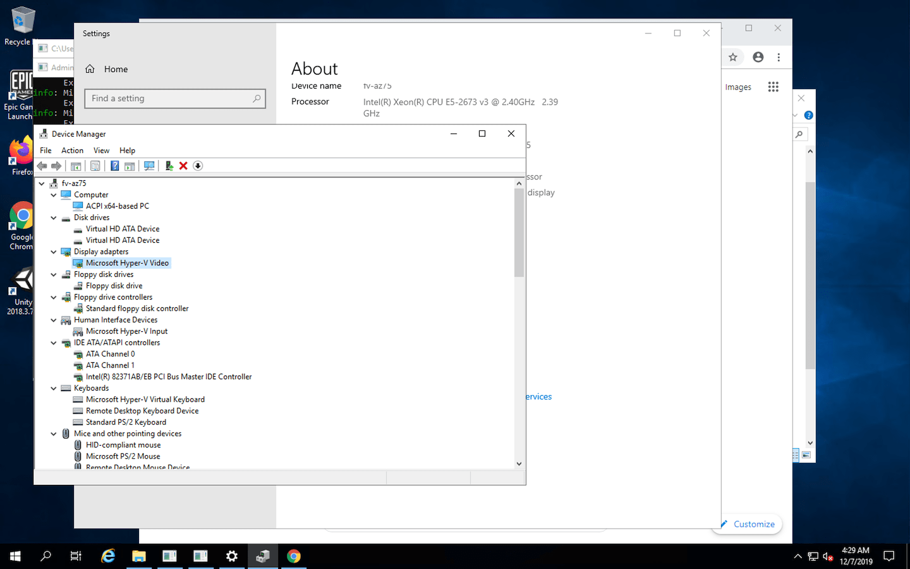

# Reverse RDP into Windows on GitHub Actions

Ever wonder what the Desktop of the Windows Runners on GitHub Actions looks like?

This functionality is like Appveyor's RDP functionality for their Windows workers:

https://www.appveyor.com/docs/how-to/rdp-to-build-worker/

## Usage

1. Assume Windows Runners cannot listen to ports. I didn't bother trying and ngrok worked anyway. So, signup for an [ngrok] account.
2. Get the tunnel auth token at: https://dashboard.ngrok.com/auth .
3. Under the repository's settings, make a secret called `NGROK_AUTH_TOKEN` and set it to the tunnel auth token from ngrok.
4. Trigger a build somehow. Maybe make a spurious commit or edit and commit the README or something.
5. Wait until the last step which will hang forever as it connects to ngrok and sets up the reverse tunnel.
6. Visit ngrok's dashboard. https://dashboard.ngrok.com/
7. Note the active tunnel's public host and port.
8. Connect to the host and port combination with your RDP client of choice.
9. Use the username `runneradmin` and the password `P@ssw0rd!`.
10. Enjoy! ☕
11. When you're done introspecting, cancel the job.

These steps should be useful for debugging broken builds directly on the build worker. Use this project as reference and toss the steps into your project after some failing part of the build for introspection.

## Useful Info

* Runners can run jobs for up to 6 hours. So you have about 6 hours minus the minute setup time to poke around in these runners.
* If using for introspection, add the [`continue-on-error`](https://help.github.com/en/actions/automating-your-workflow-with-github-actions/workflow-syntax-for-github-actions) property to the failing step before these remote connection steps.

## Future

Maybe as a GitHub Action? Oh well, this is fairly simple anyway. Or using something more FOSS than ngrok like https://github.com/TimeToogo/tunshell ?

## Similar Projects

These projects also allow remote introspection of very temporary environments like in GitHub Actions or other environments. 

* Shell-Only (macOS, Linux, and also Windows)
  * https://tunshell.com
* macOS VNC
  * https://github.com/dakotaKat/fastmac-VNCgui

## License

MIT

[ngrok]: https://ngrok.com/
